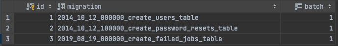
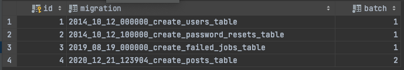
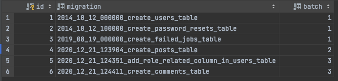
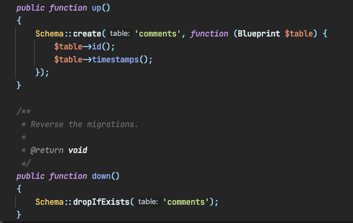
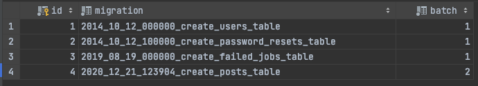

আলহামদুলিল্লাহ, অনেক অনেক দিন পরে আবারও লিখতে বসলাম। আশাকরি করোনাকালিন সময়ে আল্লাহ সবাইকে সুস্থ রেখেছেন।

লারাভেল মাইগ্রেশন, টার্মটির সাথে আশাকরি লারাভেল ডেভলপার সকলেই পরিচিত। সবাই মোটামুটি বুঝে বা না বুঝেই এটিকে হরহামেশা ব্যবহার করছি। এমন অনেককেই দেখেছি যারা অনেক বছর লারাভেলে কাজ করছেন কিন্তু মাইগ্রেশন এর সঠিক ইউসকেস জানেন না অথবা মাইগ্রেশন মূলত কি সমস্যার সমাধান করছে সেটি বুঝে উঠতে পারছেন না।

কয়েকদিন আগে আমি [Laravel Bangladesh](https://www.facebook.com/groups/LaravelBanglaDesh) গ্রুপে একটি [পোষ্ট](https://www.facebook.com/groups/LaravelBanglaDesh/permalink/1903068656499346/) করেছিলাম “লারাভেল মাইগ্রেশন কে কি পারপাসে ব্যবহার করেন” সেটি জানতে চেয়ে। এখানে মাত্র দশটি কমেন্ট পরেছে যার ৯টিই ছিলো মানুষজনের মিসকনসেপ্ট।এছাড়াও ডেভলপার কমিউনিটির সাথে সম্পৃক্ত থাকায় অনেকের সাথেই কথা বলার সুযোগ হয়েছে, তাই সেই সকল বিষয় কনসিডার করলে এটা বলা যায় আমাদের লারাভেল ডেভলপারদের ৮০ শতাংশই লারাভেল মাইগ্রেশন এর সঠিক উদ্দেশ্য বা ইউসকেস জানেন না। আর তাই আজকের এই আর্টিকেলটি লেখা।

> এটি লারাভেল মাইগ্রেশনের টিউটোরিয়াল নয়, এটি লারাভেল মাইগ্রেশনের একটি কন্সেপচুয়াল আর্টিকেল

প্রথমেই আমরা মানুষজনের মাইগ্রেশন নিয়ে ধারনা জানার চেষ্টা করি:

- এটি লারাভেলে একটি ফিচার তাই এটি অনেকে ব্যবহার করে, এরা এর সুবিধা বা অসুবিধা নিয়ে চিন্তিত না।

- অনেকের মতে এটি ডাটাবেসে টেবিল ক্রিয়েট অথবা ডিলিটের জন্য ব্যবহার করা হয়।

- অনেকে আবার মনে করে ডাটাবেসে টেবিল ক্রিয়েট, ডিলিট তো আমি সরাসরি SQL কমান্ড দিয়েই করতে পারি, তাহলে শুধু শুধু এই ঝামেলা করার মানে কি?

- অনেকে ভাবেন আমি পিএইচপি দিয়েই লিখতে পারলে বিষয়টা সহজ হবে এবং সহজেই অন্য ডেভলপারের সাথে শেয়ার করা যায়।

- আবার অনেকে ভাবেন এটি দেখতে সুন্দর এবং রিডাবেল।

> উপরের সবগুলোই আমি কারও না কারও কাছ থেকে শুনেছি, মনগড়া কথা নয়। তবে এখানে অনেকগুলো কথা আংশিক সত্য।

## তাহলে মাইগ্রেশন মূলত কি?

এক কথায় বলতে গেলে লারাভেল মাইগ্রেশন হচ্ছে ডাটাবেস এর জন্য VCS (Version Control System). হ্যা আপনি ঠিকই শুনেছেন, VCS. অর্থাৎ অ্যাপ্লিকেশন ডেভলপ এর সময় ডাটাবেসে কি কি পরিবর্তন ও পরিবর্ধন হয়েছে সেটিকে ট্রাক করাই হচ্ছে মূলত মাইগ্রেশন এর প্রধান কাজ, তবে একমাত্র কাজ নয়।

এবার চলুন জেনে নেই কেনো লারাভেল মাইগ্রেশন আমরা ব্যবহার করবো।

**ডাটাবেস হিস্ট্রি ম্যানেজ করার জন্য:**

- 2014\_10\_12\_000000\_create\_users\_table.php

- 2014\_10\_12\_100000\_create\_password\_resets\_table.php

- 2019\_08\_19\_000000\_create\_failed\_jobs\_table.php

ধরুন আমরা নতুন একটি অ্যাপ্লিকেশন ডেভলপ করছি সেখানে এই তিনটি টেবিল নিয়ে কাজ শুরু করেছি। তো এবার আমি নিচের কমান্ডটি দিয়ে মাইগ্রেশন চালাই

```
php artisan migrate
```

ফলে এই তিনটি টেবিল তৈরী হয়ে যাবে ডাটাবেসে, সাথে আরেকটি অতিরিক্ত টেবিল তৈরী হবে migrations নামে। যেটি দেখতে নিচের মতো।



যেখানে খেয়াল করলে দেখবেন তিনটি ভিন্ন ভিন্ন মাইগ্রেশন ফাইলকে এক্সিকিউট করেছে। আরেকটি বিষয় এখানে খেয়াল করবেন সেটি হচ্ছে batch. এটি প্রত্যেকবার মাইগ্রেশন চালানোর সিকুয়েন্স। অর্থাৎ এরপরে যদি আমরা নতুন কোনো মাইগ্রেশন চালাই সেগুলো ২ নম্বর ব্যাচে যাবে এবং পরেরগুলোও এভাবে ইনক্রিমেন্টাল হবে।

এবার আমরা আরেকটি নতুন টেবিল এ্যাড করবো মাইগ্রেশনের মাধ্যমে।



নতুন মাইগ্রেশনটি চালানোর ফলে আমাদের নতুন আরেকটি টেবিল ডাটাবেসে যুক্ত হয়েছে এবং মাইগ্রেশন টেবিলে নতুন একটি রো এন্ট্রি হয়েছে যার batch হচ্ছে ২।

এবার আরও দুটি কলাম users টেবিলে যুক্ত করবো সাথে একটি নতুন টেবিল তৈরী করবো।



এখানে আমি দুটি মাইগ্রেশন ফাইল নিয়েছি, একটি users টেবিলে কলাম যুক্ত করার জন্য এবং অপরটি হচ্ছে comments নামে নতুন একটি টেবিল তৈরীর জন্য। দেখুন যেহেতু দুটি কাজই একই মাইগ্রেশনে ঘটেছে তাই এই দুটি মাইগ্রেশন এর batch একই, অর্থাৎ ৩। এই ব্যাচই হচ্ছে একেকটি ভার্সন।

একটু খেয়াল করলে দেখবেন এই migrations টেবিলের ডাটা মূলত আপনার মাইগ্রেশনের হিস্ট্রি দেখাচ্ছে। আপনি এটি দেখলে একপলকেই বুঝে যাবেন কখন কি ঘটেছিলো। মনে রাখবেন মাইগ্রেশন ফাইলের নাম সবসময় অর্থবোধক কিছু লিখবেন যাতে এর মূল উদ্দেশ্যটি বোঝা যায় অর্থাৎ এটি কি কাজ করে সেটি যেন সহজেই বোঝা যায়। তাছাড়াও যখন টিমে কয়েকজন ডেভলপার একই প্রোজেক্টে কাজ করবে তখন গিট কমিট দেখে বোঝা যাবে কে কখন কোন মাইগ্রেশন লিখেছে, এবং এর উদ্দেশ্য কি ছিলো, যেটি আপনি ডিরেক্টলি ডাটাবেসে চেঞ্জ করলে ট্রাক করা সম্ভব নয়।

**রোলব্যক:**

আমরা তো ব্যাচ কি সেটি দেখলাম এবং এও জানলাম মাইগ্রেশন হচ্ছে ডাটাবেসের জন্য VCS. তাহলে VSC এ যেমেন পূর্ববর্তী ভার্সনে ফিরে যাওয়া যায় এখানে কি সেটি সম্ভব? হ্যা সম্ভব। আর এটিকেই বলে রোলব্যাক। লারাভেল মাইগ্রেশনের দুটি অংশ, একটি হচ্ছে up এবং অন্যটি হচ্ছে down. Up মূলত কোনো নতুন পরিবর্তনকে বুঝায় আর ডাউন হচ্ছে সেই পরিবর্তনকে যদি রোলব্যাক করি তবে কি হবে সেটিকে বুঝায়।



তো, এবার যদি আমরা আমাদের ডাটাবেসে লারাভেল মাইগ্রেশন দিয়ে রোলব্যাক করি তবে কি হয় একটু দেখি।

```
php artisan migrate:rollback
```



দেখুন আমাদের ৩ নম্বর ব্যাচটি নেই, অর্থাৎ আমাদের ডাটাবেস ২ নম্বর ব্যাচ বা ভার্সনে রোলব্যাক করেছে। এই ফিচারটি এতো সহজেই আপনি সরাসরি ডাটাবেসে সিকুয়েল কমান্ড চালিয়ে করতে পারবেন না।

**এ্যাবস্ট্রাকশন ও ইন্টারঅপারেবিলিটি:**

এটিও একটি বড় ফ্যাক্টর। ধরুন আপনি ডেভলপমেন্ট এনভাইরনমেন্টে চালাচ্ছে MySQL আর আপনার অন্য কলিগ সে ব্যবহার করছে SQLite. আপনি যদি সরাসরি sql ফাইল দিয়ে ডাটাবেসে পরিবর্তন করতেন তবে আপনার কলিগ সেটি SQLite দিয়ে কাজ চালাতে পারতেন না। হয় তাকে SQLite এর জন্য নতুন করে কমান্ড লিখতে হতো নতুবা আপনাকে MySQL এর সাথে SQLite এর কমান্ড প্রোজেক্টের সাথে দিতে হতো। যেটি একটি লিমিটেশন। আর এই কাজটিই খুব সহজ করে দিয়েছে লারাভেল মাইগ্রেশন। লারাভেল মাইগ্রেশনে আপনি মাইগ্রেশন ফাইলে লিখবেন, আপনাকে ভাবতে হবে না যে MySQL, MariaDB, SQLite বা অন্যান্যদের জন্য কিভাবে কাজ হবে। লারাভেল মাইগ্রেশন এটি নিজেই টেক কেয়ার করবে।

**পোর্টেবিলিটি:**

আরেকটি বড় সুবিধা হচ্ছে পোর্টেবিলিটি। অর্থাৎ মাইগ্রেশন লেখার ফলে পুরো প্রোজেক্টের পোর্টেবিলিটি বৃদ্ধি পায়। ফলে টিমে কাজ করা বা কোড সিংক করা সহজ হয়। কোনো নতুন মেম্বারকে ভাবতে হয় না ডাটাবেসের বিষয় নিয়ে। কারন এটি প্রোজেক্টের সাথে টাইটলি কাপলড অবস্থায় থাকে। ফলে এটি সহজেই বহন করা যায়। আরেকটা বড় বিষয় হচ্ছে এই মাইগ্রেশন ফাইল পরেই অন্য একজন ডেভলপার খুব সহজেই বিজনেস লজিক সম্পর্কে ধারনা পেয়ে থাকেন।

**রিডেবিলিটি ও ম্যানেজেবিলিটি:**

মাইগ্রেশন বিজনেস লজিক ও ডাটাবেস স্কিমা’র রিডেবিলিটি বাড়ায়। মাইগ্রেশন ফাইল দেখে খুব সহজেই ডাটাবেস স্কিমা সম্পর্কে ধারনালাভ করা যায় এবং এটি ডিবাগ করতেও সহজ। এটি টিমে সকলের কাজে সিংকআপ করতে সাহায্য করে। কেউ যদি ডাটাবেসে কোনো পরিবর্তন আনে সেটা সকলের সাথে খুব সহজেই সিংক হয়। ফলে ডেভলপারকে ভাবতে হয়না অন্য ডেভলপার কিভাবে কাজ করবে সেটি নিয়ে। এছাড়াও এটি একটি অটোমেটেড প্রক্রিয়া ফলে এটি ডেপলয়মেন্টেও আরও সহজ ও স্মুথ করে। প্রোডাকশনে ডেপলয়মেন্ট ভাবতে হয়না ডাটাবেস পরিবর্তনগুলো কিভাবে হবে। এটি CI/CD দিয়ে ম্যানেজ করাও সহজ।

তাই এটি ভাবার কোনো কারন নেই লারাভেল মাইগ্রেশন টেবিল ক্রিয়েট, ডিলিট কে সহজ করে। হ্যা এটি এর একটি কাজ তবে এটিই এর উদ্দেশ্য নয়।

আশা করি এই আর্টিকেলটি লারাভেল মাইগ্রেশন এর মূল উদ্দেশ্য ও ফিলোসফি বুঝতে আপনাদের সহায়তা করবে।

যেকোনো ধরনের ভুল ত্রুটি চোখে পরলে নির্দিধায় ধরিয়ে দেয়ার অনুরোধ করছি।

ধন্যবাদ 😀
