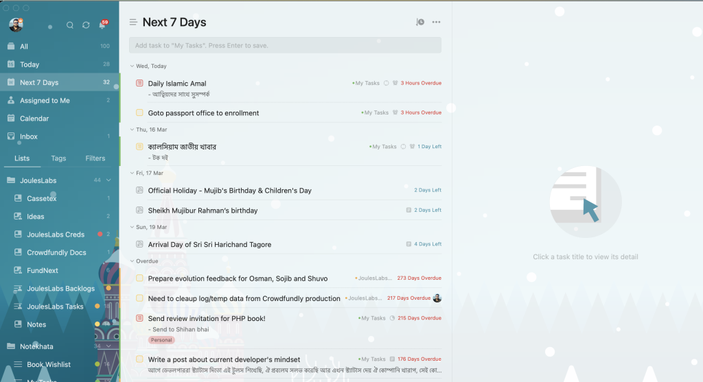
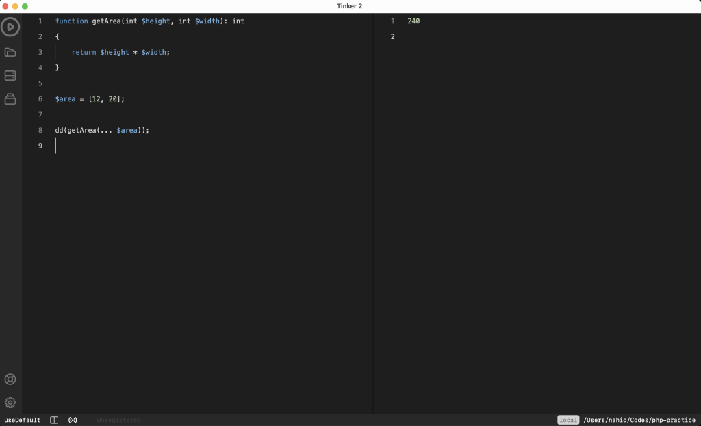
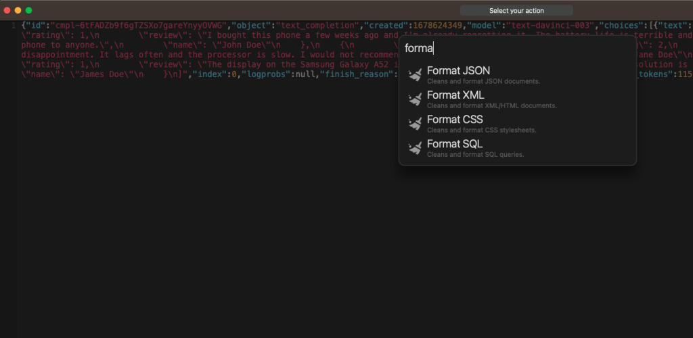
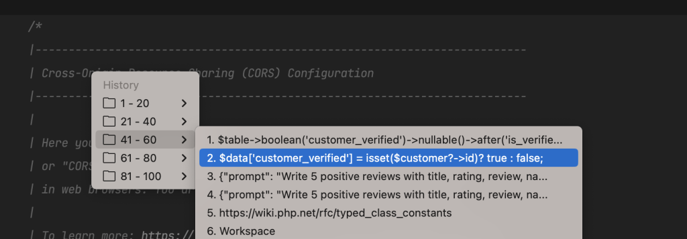
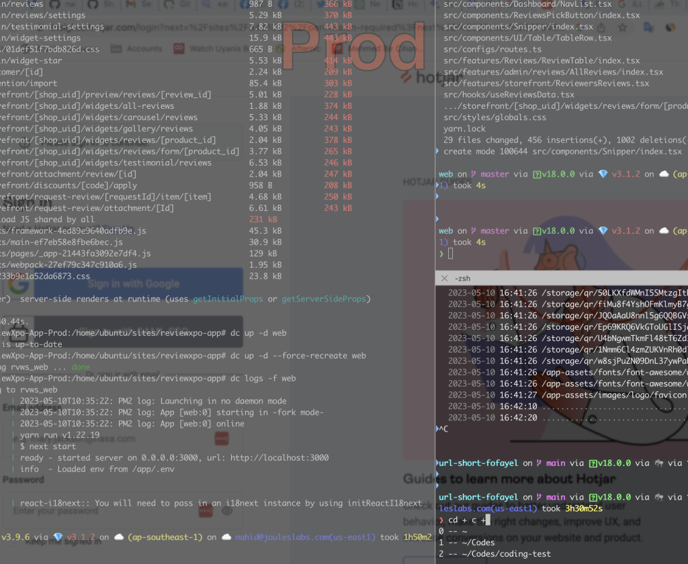
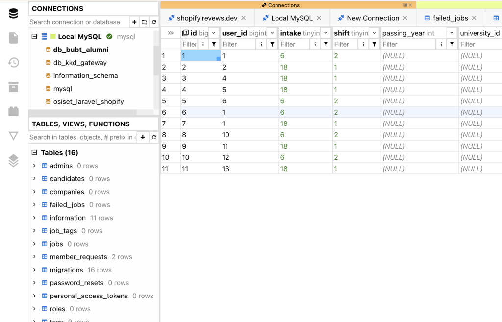

আসসালামুআলাইকুম, আশাকরি সবাই ভালো আছেন। বেশ অনেকদিন থেকে ভাবতেছিলাম আমি যেসকল এ্যাপ আমার প্রাত্যহিক জীবনে ব্যবহার করি আমার প্রোডাক্টিভ ডেভলপমেন্টের জন্য সেগুলো আপনাদের সাথে শেয়ার করি, এতে করে হয়তো আপনারা অনেকে নতুন নতুন কিছু এ্যাপের সন্ধান পেলেন এবং এর উপকারিতা সম্পর্কেও অবগত হলেন। আশাকরি এই লেখাটি আপনাদের ভালো লাগবে।

## TickTick

আমার দেখা এখন পর্যন্ত সবথেকে সুন্দর ও ইউজার ফ্রেন্ডলি টুডু এ্যাপ হচ্ছে TickTick. এটির UI যেমন চমৎকার ঠিক তেমনি এর User Experience'ও দারুন। আমি এর অসাধারন কিছু ফিচার নিয়ে নিচে জেনে নেই,

- মাল্টিলেভেল টুডু লিস্ট তৈরী করা যায়।

- প্রোগ্রেসিভ টুডু তৈরী করা যায় ফলে আপনার চেকলিস্টের সকল আইটেম কমপ্লিট হবার আগ পর্যন্ত টুডু done হবে না।

- লিস্ট, ক্যাটেগরী ও ট্যাগের মাধ্যমে আপনি সহজেই আপনার টুডুকে পৃথক করতে পারবেন।

- এর রয়েছে এক্সটেন্সিভ রিমাইন্ডার সিস্টেম, এতো দারুন আর সরল রিমাইন্ডার সিস্টেম আমি অন্য এ্যাপে দেখিনি।

- এছাড়াও আপনি এই এ্যাপের মাধ্যমে কাস্টমাইজড রিপিট তৈরী করতে পারবেন, যেটা খুবই কার্যকরী।

- এতে রয়েছে Kanban সুবিধা।

- একাধিক ইউজারকে আপটি একটি লিস্টে যুক্ত করতে পারবেন।

- টাস্ককে আপনি স্পেসিফিক ইউজারকে মেনশন করতে পারবেন।

- এর রয়েছে অসাধারন গ্লোবাল ও লোকাল কিবোর্ড শর্টকাট যা আপনার নিত্যদিনের কাজে সহজ করবে।

- আরেকটি অসাধারন ফিচার রয়েছে এই এ্যাপটিতে, Habit. এটি খুবই উপকারি একটি ফিচার। যেমন আপনি চাচ্ছেন প্রতিদিন ফজরের সলাত আদায় করতে কিংবা প্রতিদিন আপনি আর্লি ঘুমাতে যেতে চান অথবা আপনি সপ্তাহে নির্দিষ্ট তিনদিন সুইমিং করবেন, এধরনের নানান হেবিট আপনি তৈরী করে সেটি আপনার দৈনন্দিন জীবনে প্রয়োগ করতে পারেন।

- TickTick'য়ে আপনি Google Calendar থেকে ইভেন্টগুলোলো সিঙ্ক করতে নিতে পারবেন।

- এর রয়েছে চমৎকার নটিফিকেশন সিস্টেম।

- এটি ক্রস প্লাটফর্ম এপ্লিকেশন, তাই আপনি এটি Android, iOS, MacOS, Windows ও Web এই সকল প্লাটফর্মে সিমলেসলি চালাতে পারবেন।

- মোবাইলের এর রয়েছে চমৎকার popup system.

আমি ব্যক্তিগতভাবে এটির পেইড ভার্সন ব্যবহার করি, তবে এর ফ্রী ভার্সনেও অনেক ফিচার রয়েছে। এমনকি আপনি এর ফ্রী ভার্সন দিয়েও এর অলমোস্ট সকল কাজই চালাতে পারবেন।

**Type**: Freemium  
**Platform**: Android, iOS, MacOS, Linux, Windows, Chrome Extension, Firefox Extension  
**Price**: ৳250-month  
**Website**: [https://ticktick.com](https://ticktick.com)

## Tinker2

Tinker2 PHP'র জন্য ডেস্কটপ বেজড দারুন একটি REPL. আমার প্রতিদিনকার ডেভলপমেন্টে এটি ফ্রিকুয়েন্টলি ব্যবহার করা হয়। আমাদের এমন অনেক সময়েই আসে যখন ছোট একটি কোড স্নিপেট কোথাও রান করে এর আউটপুট দেখে নেয়ার প্রয়োজন হয়। আমরা এই কাজটি PHP'র জন্য `php -a` কমান্ড রান করে সেখানে করতে পারি। কিন্তু কনসোলে কোড লেখা বিরাট একটি হ্যাসেল এবং কোড সহজে মডিফাই করাও যায় না। Tinker2 আপনাকে এই কাজটি খুব সহজেই করতে দেয়, এটি জাস্ট একটি কোড এডিটরের মতোই। এটি আপনাকে কোড সাজেশন দিবে, এবং অটো কমপ্লিটের সাপোর্টও রয়েছে এতে। মজার বিষয় হচ্ছে Tinker2'তে Laravel ও WordPress সাপোর্ট রয়েছে। ফলে আপনি আপনার প্রোজেক্টের কোনো কোড বা ফাইল মডিফাই না করেই আপনার প্রয়োজনীয় প্রোগ্রাম Laravel কিংবা WordPress এনভাইরনমেন্টে রান করাতে পারবেন।

**Type**: Paid  
**Platform**: MacOS, Linux, Windows  
**Price**: $12-month  
**Website**: [https://tinker2.app](https://tinker2.app)

## Boop

Boop হচ্ছে ডেভলপারদের জন্য প্রতিদিনকার ব্যবহার্য প্রয়োজনীয় একটি টুল। আমরা প্রতিদিনই এই সফটওয়্যার কম বেশি ব্যবহারর হয়। এই ইউটিলিটি টুলটি মূলত একই সাথে অনেকগুলো কাজ সম্পাদনের সুযোগ দেয়। যেমন:

- JSON prettify and format

- Format XML Data

- Format CSS

- Format SQL

- Base64 encode & decode

- Case (Start case, Snake case, Camel Case, Kebab case, Upper case, Lower case)

- YAML to JSON

- Date to timestamp

- Date to UTC

- MD5 Checksum

- Binary to Decimal

- Decimal to Binary

- Count Character

- JSON to Query string

- Remove duplicate lines

- Hash (SHA1, SHA256, SHA512, MD5)

- Trim text

- PHP Unserialize

- Lorem Ipsum Generator

- CSS minify

- JSON to PHP Array

এছাড়াও আরও নানাবিধ কাজ এই টুলটির মাধ্যমে সম্পাদন করা যায়। তাছাড়া এটিতে আপনি Custom Script যুক্ত করে নিজের প্রয়োজন মতো কাজ করে নিতে পারবেন। উপরে উল্লেখিত কাজগুলো আমাদের হরহামেশাই দরকার পরে, সেক্ষেত্রে আমরা ইন্টারনেটে খুজে হয়তে সেখানে কাজ করে নেই, কিন্তু আমার মেশিনে যদি এই এ্যাপ্লিকেশনটা ইনস্টল থাকে তবে ঝটপট কাজটি সেরে ফেলা সম্ভব হয়। এতে করে সময় যেমন সাশ্রয় হয় তেমনি প্রোডাক্টিভিটিও বৃদ্ধি পায়।

**Type**: Opensource  
**Platform**: MacOS  
**Price**: Free  
**Website**: [https://github.com/IvanMathy/Boop](https://github.com/IvanMathy/Boop)

## Clipy

আমার প্রতিদিনকার অধিক ব্যবহৃত অন্যতম এ্যাপ হচ্ছে Clipy. এই একটি এ্যাপ আপনার প্রতিদিনকার একটি বড় সময় সেভ করবে। Clipy মূলত একটি Clipboard Manager যা আপনার Clipboard'য়ের সকল হিস্ট্রী সংরক্ষন করে এবং প্রয়োজনমতো সেগুলো পুন:ব্যবহারের সুযোগ দেয়। এছাড়ও এটিতে রয়েছে Snippet ফিচার যা আপনার প্রতিদিনকার ফ্রীকুয়েন্টলি ব্যবহার্য টেক্সটগুলোকে সংরক্ষন করে রাখার কাজে ব্যবহার হয়, যেমন আপনি চাইলে আপনার Github personal token, SSH key কিংবা বড় কোনো কমান্ড এখানে সেভ করে রাখতে পারবেন ভবিষ্যতে ব্যবহারের জন্য।

এটিতে রয়েছে ইন্সট্যান্ট Clipboard কিংবা Snippet ডাটা পেস্ট করার সুবিধা, এছাড়া এটিতে Global Keyboard Shortcut সাপোর্ট করে। যেমন আমি Clipboard হিস্ট্রি থেকে ডাটা পেস্ট করার জন্য `CTRL + SHIFT + V` কমান্ড ব্যবহার করি, এই কমান্ডটি চালালে উপরের ছবির মতো একটি popup menu চলে আসে আমার পূর্বের হিস্ট্রির ডাটা নিয়ে। আমি আমার সেটিংস'য়ে পূর্বের ১০০ হিস্ট্রী সংরক্ষন করি, আপনি আপনার চাহিদা অনুযায়ী এটি বাড়াতে কমাতে পারবেন।

> এর একটিই সমস্যা, সেটি হচ্ছে আপনি Mac ব্যবহারকারী না হলে এটি ব্যবহার করতে পারবেন না।

**Type**: Opensource  
**Platform**: MacOS  
**Price**: Free  
**Website**: [https://github.com/Clipy/Clipy](https://github.com/Clipy/Clipy)

## LastPass

আমাদের ডেভলপারদের প্রতিদিন হাজারো সাইটে কিংবা এ্যাপ্লিকেশনে কাজ করতে হয়। এসকল জায়গায় কাজ করতে গিয়ে আমাদের প্রতিদিনই নতুন নতুন সাইটে রেজিস্ট্রেশন বা সাইনআপ করতে হয় ফলে সেখানে নতুন পাসওয়ার্ড দিতে হয়। এই যে হাজারো সাইটে হাজারো পাসওয়ার্ড সেটা মনে রাখা এটি সত্যিই একটা বড় হ্যাসেল যা আপনার প্রোডাক্টিভিটিকে ডাউন করে। এমন অনেক সময় হয় যে পাসওয়ার্ড মনে নেই তাই আমাকে Forget Password দিয়ে পাসওয়ার্ড রিসেট করে নিতে হয়েছে, যা বেশ সময় সাপেক্ষ। এই ঝামেলা থেকে এড়ানোর জন্য আমি ব্যবহার করি **LastPass**. অসাধারন একটি Password Manager এটি। অলমোস্ট সকল প্লাটফর্মে এটি কাজ করে। আমি এটির পেইড(Premium) ভার্সন ব্যবহার করি, তবে এর রয়েছে Free এবং Family প্যাক। ফ্রী'তে কিছু লিমিটেশন রয়েছে, যেমন দুটি ডিভাইসে একই সময়ে লগইন থাকা যাবে না। তবে যারা শুধু PC'র জন্য ব্যবহার করতে চান তাদের ফ্রী অপশনটিই ভালো। এছাড়া এর Family প্যাকটি চমৎকার, এখানে ৬ টি একাউন্ট ব্যবহার করা যাবে যেটি মাত্র মাসে $4 মাত্র।

#### ফিচারসমূহ:

- Password Save and Autofill

- Password Generation

- Passwordless Authentication with LastPass Authenticator

- Store Digital Records (Credit Card, Driving License, Wifi Password, etc)

**Type**: Freemium  
**Platform**: Linux, MacOS, Window, Browsers, Android, iOS  
**Price**: $3-month  
**Website**: [https://lastpass.com](https://lastpass.com)

## PhpStorm

যেহেতু পেশায় আমি একজন সফটওয়্যার ইঞ্জিনিয়ার তাই কোড লেখা, ডিবাগ করা, টেস্ট করাই হচ্ছে আমরা প্রাইমারী কাজ। একজন সফটওয়্যার ইঞ্জিনিয়ারের জন্য ভালো একটি IDE নির্বাচন সবথেকে গুরুত্বপূর্ন একটি বিষয়। এটি আপনার কাজের গতি বহুলাংশে বৃদ্ধি করবে। আমি আমার ক্যারিয়ারে অনেকগুলো IDE ট্রাই করেছি কিন্তু PhpStorm এর মতো এতো চমৎকার ও এতো ফিচাররিচ কোনো IDE এখনও খুজে পাইনি। এর উল্লেখযোগ্য ফিচারসমূহ:

- Code editing

- Code Auto-completion

- Refactoring

- Code Highlighting

- Profiling

- Code Analysis

- Advanced search system

- Full project search

- Code navigation

**Type**: Premium  
**Platform**: Linux, MacOS, Window  
**Price**: $9.90-month  
**Website**: [https://www.jetbrains.com/phpstorm/](https://www.jetbrains.com/phpstorm/)

## SublimeText

আমি IDE'র পাশাপাশি সবসময়েই একটি কোড এডিটর ব্যবহার করি। এর প্রধান কারন হচ্ছে সহজেই টুকিটাকি কোড এডিট করা। বিভিন্ন সিস্টেম ফাইল, কনফিগ ফাইল ইত্যাদি অন দ্যা ফ্লাই এডিট করা। এই কাজে আমার জন্য ফাস্টার লোড হয়, হালকা পাতলা এবং ভেরী মিনিমাল সিম্পল ডিজাইনের একটা Editor দরকার, যেটা আমি SublimeText এর ভিতরে পাই।

**Type**: Freemium  
**Platform**: Linux, MacOS, Window  
**Price**: $99 (With 3 years of updates)  
**Website**: [https://www.sublimetext.com](https://www.sublimetext.com)

## iTerm2

সফটওয়্যার ইঞ্জিনিয়ার কিংবা ডেভলপারদের প্রতিদিনকার ব্যবহৃত একটি টুল হলো CLI. Mac এর জন্য ডিফল্ট Emulator এর নাম হচ্ছে Terminal. তবে আপনি চাইলে আপনার পছন্দ মতো Terminal Emulator ব্যবহার করতে পারেন। আমি Mac'য়ে CLI এর জন্য iTerm2 ব্যবহার করি। এটি এক্সটেসিবল, ফিচাররিচ, কাস্টমাইজেবল এবং হ্যান্ডি। যে কারনগুলো জন্য আমি iTerm2 ব্যবহার করি।

- Split Panes

- Search

- Auto Completion

- Hotkey Window

- Floating Window

- Copy Mode

- Lots of color schemes

- Transparent and Blur Window

- Support Multiple Shells

**Type**: Opensource  
**Platform**: MacOS  
**Price**: Free  
**Website**: [https://iterm2.com](https://iterm2.com)

## ZSH

ZSH হচ্ছে Bash এর অল্টারনেটিভ। যার অর্থ হচ্ছে Z-Shell. আমরা Unix ভিত্তিক অপারেটিং সিস্টেমে ডিভল Shell হিসেবে Bash ব্যবহার করি। তবে আপনি যদি এর থেকেও এডভ্যান্স ফিচার চান তবে অন্যন্য Shell ব্যবহার করতে পারেন। সেক্ষেত্রে আমি ব্যবহার করি ZSH. আমি ZSH এর সাথে [OhMyZSH](https://github.com/ohmyzsh/ohmyzsh) ফ্রেমওয়ার্কটি ব্যবহার করি। এর উল্লেখযোগ্য ফিচার সমূহ:

- Support multiple themes

- Support plugins

- Faster auto completion

- More configurable

**Type**: Opensource  
**Platform**: Unix based OS  
**Price**: Free  
**Website**: [https://www.zsh.org/](https://www.zsh.org/)

## Vim

Vim হচ্ছে CLI এর জন্য একটি জনপ্রিয় Text Editor. এটি হাইলি কাস্টমাইজেবল এবং ফাস্টার। আমি সাধারনত সার্ভার সাইডে টেক্সট বা কোড এডিটিং এর জন্য Vim ব্যবহার করি। এটিতে রয়েছে দারুন সব হ্যান্ডি কী-বোর্ড শর্টকাট যা CLI তে আপনার টেক্সট এডিটিং এক্সপেরিয়েন্সকে বহুগুন বৃদ্ধি করবে।

**Type**: Opensource  
**Platform**: Linux, Mac, Windows  
**Price**: Free  
**Website**: [https://www.vim.org](https://www.vim.org)

## Postman

যারা প্রতিদিনই API ডেভলপমেন্টের কাজ করেন তাদের প্রত্যাহিক কাজের ভিতের API Design, Test and Debug করার জন্য কোনো না কোনো API ক্লায়েন্ট ব্যবহার করতে হয়। আমি API ক্লায়েন্ট হিসেবে Postman ব্যবহার করি। এর রয়েছে দারুন UI, এটিতে API collection তৈরী করা এবং এনভাইরনমেন্ট সেট করা খুবই সহজ। Postman এর রয়েছে অসাধারন API Test Automation ফিচার।

**Type**: Freemium  
**Platform**: Linux, Mac, Windows  
**Price**: $12-month(Starting)  
**Website**: [https://www.postman.com](https://www.postman.com)

## DBGate

যারা সফটওয়্যার ডেভলপমেন্টের কাজ করে তাদের ডাটাবেসের সাথে কাজ করাটা একটা কমন বিষয়, আর এর জন্য রয়েছে নানান Database Client, যার মাধ্যমে আমরা গ্রাফিক্যালি ডাটাবেসের সাথে ইন্টার্যাক্ট করতে পারি। মার্কেটে অনেক অনেক ডাটাবেস ক্লায়েন্ট রয়েছে, যেগুলো মোটামুটি ভালো তার প্রায় সবগুলোই পেইড, আর বাকিগুলোতে কিছু না কিছু প্রয়োজনিয় ফিচার মিসিং। আমি Database ক্লায়েন্ট হিসেবে ব্যবহার করি DBGate. এটি চমৎকার একটি ডাটাবেস ক্লায়েন্ট, এটি অনেকগুলো জনপ্রিয় ডাটাবেস সার্ভার সাপোর্ট করে, যেমন: MySQL, MariaDB, PostgreSQL, MongoDB, Redis সহ আরও অনেকগুলো।

**Type**: Opensource  
**Platform**: Linux, Mac, Windows  
**Price**: Free  
**Website**: [https://dbgate.org](https://dbgate.org)

## Ngrok

এটি একটি চমৎকার টানেলিং সিস্টেম যেটা আপনার লোকাল মেশিনকে ইন্টারনেটে এক্সপোজ করার জন্য ব্যবহার করা হয়। Ngrok এর কমন ইউজকেস হচ্ছে ডেভলপমেন্ট এবং টেস্টিং, এছাড়াও এটি রিমোট থেকে আপনার লোকাল নেটওয়ার্ককে এক্সেসক করার জন্যও ব্যবহার হয়। আমি রিসেন্ট সময়ে Shopify App Development নিয়ে কাজ করছি তাই Ngrok আমার প্রতিদিনই ব্যবহার করতে হয়।

**Type**: Freemium  
**Platform**: Linux, Mac, Windows  
**Price**: $12-month (starting)  
**Website**: [https://ngrok.com](https://ngrok.com)

এছাড়াও অনেক এ্যাপ্লিকেশন বা টুলস ব্যবহার করতে হয় প্রাত্যাহিক কাজের জন্য যেগুলো মোটামুটি সকলেই করেন তাই সেগুলো আর বিশেষ করে উল্লেখ করলাম না। তবে এখানে যদি উল্লেখ করার মতো কিছু ভুলে গিয়ে থাকি তবে পরবর্তীতে সেটা ইনশা'আল্লাহ আপডেট করে দিবো।

ভালো থাকবে আর সময় পেলে আপনি কোন কোন টুলস ও এ্যাপ্লিকেশন প্রতিদিনকার কাজে ব্যবহার করেন সেটা কমেন্টে জানাতে পারেন, ধন্যবাদ :)
