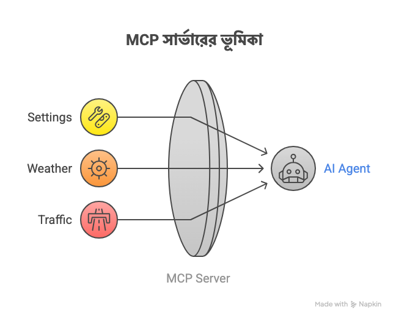
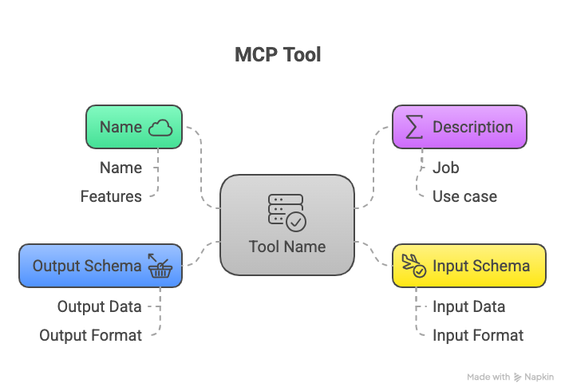

আলহামদুলিল্লাহ, আজকে নিজের স্বল্প জ্ঞান দিয়ে লিখতে বসেছি MCP(Model Context Protocol) Server নিয়ে। এই লেখায় আমরা জানার চেষ্টা করো MCP সার্ভার আসলে কি জিনিস, এটা কি সমস্যার সমাধান করছে এবং এটি কিভাবে AI Agnet এর সাথে কাজ করে? তো চলুন কথা আর দীর্ঘ্য না করে মূল বিষয়ে চলে যাই।

## MCP Server কি?

**MCP Server (Model Context Protocol Server)** হচ্ছে এমন একটা সার্ভার, যেটা AI Agent বা LLM (Large Language Model)-কে বিভিন্ন **external tools** বা **services** এর সাথে যুক্ত করতে সাহায্য করে – অর্থাৎ AI Agent বা LLM এক্সটার্নাল টুলস বা সার্ভিসেসকে যে প্রোটোকল দিয়ে ডিসকভার করে ব্যবহার করা হয় সেটাই MCP বা Model Context Protocol. আর এই সার্ভিস বা টুলস যেই সার্ভারে রান করে সেটাই হচ্ছে MCP server.

আরেকটু সহজ করে বললে, আমরা জানি AI বা LLM গুলো রিয়েল টাইম ডাটা নিয়ে কাজ করে না, কিন্তু এমন অনেক কেস রয়েছে যেখানে তার কোনো একটা কাজ সম্পন্ন করতে হলে রিয়েল টাইম ডাটাকে একসেস করতে হয় কিংবা থার্ডপার্টি কোনো সার্ভিসের সাথে কানেক্ট করতে হয়। যেমন ধরুন আপনাকে বর্তমান weather ইনফরমেশন নিয়ে কাজ করতে হতে পারে, কিংবা আপনাকে আপনার পার্সোনাল ক্যালেন্ডারের ইনফরমেশন এক্সেস বা মডিফাই করার প্রয়োজন হতে পারে, কিংবা আপনার পার্সোনাল মেইলের ইনবক্সের একটা সামারী জেনারেট করতে হতে পারে AI বা LLM দিয়ে, সেটা কিভাবে করবেন? হ্যা এই কাজগুলোকেই সহজ করে দিচ্ছে একেকটা MCP Server.

### MCP Server কিভাবে কাজ করে?

একটি MCP সার্ভারের এক বা একাধিক টুলস বা ফাংশন থাকতে পারে। MCP Server মূলত AI Agent এবং এই টুলস গুলোর ভিতরে Middleware হিসেবে কাজ করে।



**যেমনটা আগেই বলেছি একটা MCP server এর একাধিক টুল থাকতে পারে। প্রতিটি টুলের নিম্নের প্রোপার্টিগুলো থাকবে**

- Name - অর্থাৎ এই টুল বা ফাংশনের কি নাম সেটা, যেটি দিয়ে MCP সার্ভার মূলত বিভিন্ন কাজে কল করবে।

- Description - এখানে বলা থাকবে এই টুলটি মূলত কি কাজ করে বা করবে।

- Input - অর্থাৎ এই টুল বা ফাংশন কি রিসিভ করবে প্রোসেস করার জন্য সেটা।

- Output - এই টুল বা ফাংশন কি রিটার্ন করবে সেটা।



নিচে বুঝার সুবিধার্থে একটা স্যাম্পল JSON স্কিমা দেয়া হলো।


```json
{
  "name": "getCurrentWeather",
  "description": "Get current weather information for a given city.",
  "inputSchema": {
    "type": "object",
    "properties": {
      "city": {
        "type": "string",
        "description": "Name of the city to check weather for"
      }
    },
    "required": ["city"]
  },
  "outputSchema": {
    "type": "object",
    "properties": {
      "temperature": {
        "type": "number",
        "description": "Current temperature in Celsius"
      },
      "condition": {
        "type": "string",
        "description": "Weather condition (e.g., Sunny, Rainy)"
      }
    },
    "required": ["temperature", "condition"]
  }
}
```

### Tool Discovery

এবার যখন কোনো একটা ইউজার AI Agent'কে কোনো নির্দিষ্ট একটা কাজ করতে বলবে তখন সেই এজেন্ট মূলত প্রথমে Tool Discovery করবে। একটা এআই এজেন্ট মূলত অনেকগুলো MCP Server এর সাথে কানেক্টেড থাকতে পারে, এজেন্ট এই MCP server থেকে Tool Discovery এজেন্ট ইনিশিয়ালিজেশনের সময়েও করতে পারে অথবা ইউজারের নির্দিষ্ট কোনো কাজের সময়েও অন-ডিমান্ডে করতে পারে। এটা মূলত ইমপ্লিমেন্টেশনের উপরে নির্ভর করে।  
তো Tool Discovery'টা মূলত কি? Tool Discovery হলো AI Agent তার সকল কানেক্টেড MCP সার্ভারকে জিজ্ঞেস করবে "তোমাদের কার কি কি টুলস রয়েছে"? ফলে সে বুঝে যাবে কোন MCP কি কি কাজ করতে পারবে। এই Tool Discovery এরও একটা স্টান্ডার্ড রয়েছে, প্রত্যেক MCP সার্ভার মূলত টুল লিস্ট মূলত `discovery` কমান্ড অথবা `GET /toos` API এর মাধ্যমে দিয়ে থাকে এবং এজেন্ট এই সবগুলো টুলের মেটাডাটা নিয়ে নিজের Context তৈরী করে রাখে পরবর্তীতে ব্যবহারের জন্য।

> এখানে বলে রাখা ভালো যে MCP সার্ভার মূলত `stdio` অথবা RestAPI এর মাধ্যমে কমিউনিকেট করে থাকে।

### Tool Routing

এটি হচ্ছে আরেকটি গুরুত্বপূর্ন বিষয় যে AI Agent কিভাবে একটা ইউজারের রিকুয়েস্টকে Route করে সঠিক MCP server'য়ে পাঠাবে। Agent যখন ইউজারের কাছ থেকে কোনো নির্দেশনা পায়, তখন সে নিজের কন্টেক্সট দেখে বিচার করে নিম্নরূপ:

- ইউজারের রিকুসেষ্টের ইন্টেন্ট বা উদ্দেশ্য কি?

- এই রিকুয়েস্ট সার্ভ করার জন্য আমাকে কোন Tool বা ফাংশন কল করতে হবে?

- সেই টুল বা ফাংশন কোন MCP সার্ভারে রয়েছে?

ধরুন আপনার AI Agent ৩টি MCP Server এর সাথে যুক্ত রয়েছে

- MCP A - Weather Tools

- MCP B - Calendar Tools

- MCP C - Map Tools

এবার ইউজার যদি AI Agent'কে বলে যে: _আগামীকাল বৃষ্টি হলে দিনের সকল মিটিং ক্যান্সেল করে দাও।_

এজেন্ট এখান থেকে ইউজারের ইন্টেন্ট বের করবে এবং নিজেই রাউটিং করে MCP A ও MCP B কে আলাদা কল দিয়ে নিজেই টুল Chain তৈরী করে ফেলবে।

### Tool Invocation

প্রত্যেক MCP Tool-এর metadata তে থাকে **Tool Source বা Origin**, এবং তা থেকে Agent জানে কোন টুলকে কি প্যারামিটার বা আর্গুমেন্ট দিয়ে কল করতে হবে, ধরুন

- MCP A তে রয়েছে `getWeatherByCity` টুল

- MCP B তে রয়ছে `cancelAllEventsByDate` টুল

এই যে ইনফরমেশনগুলো, এগুলো কিন্তু আমাদের এজেন্টের কাছে থাকবে। এবার এজেন্ট Context-Aware কল করবে নিচের মতো করে\_


```json
{
  "tool": "getWeatherByCity",
  "arguments": { "city": "Dhaka" }
}
➡ sent to MCP Server A
```


```json
{
  "tool": "cancelAllEventsByDate",
  "arguments": { "date": "tomorrow"}
}
➡ sent to MCP Server B

```

## MCP যেভাবে AI Agent'কে সাহায্য করে

| **এজেন্টের সমস্যা** | **MCP এর সমাধান** |
| --- | --- |
| হার্ডকোড লজিক লেখা জটিল। | MCP সার্ভারের কারনে AI Agent গুলোতে হার্ডকোড লজিক লিখতে হয় না। এজেন্ট টুলের নাম, বিবরন, ইনপুট-আউটপুট স্কিমা দেখেই সিদ্ধান্ত নিতে পারে। |
| এখানে ডাইনামিক টুলিং এর সিমাবদ্ধতা রয়েছে। | সহজেই MCP টুল রেজিস্টার করা যায় রানটাইমে। |
| LLM গুলো সরাসরি টুলের ইন্টারফেসকে বুঝতে পারে না। | MCP সার্ভার টুল মেটাডাটা ও স্কিমা ডেফিনেশন দিয়ে LLM এর সাথে ব্রিজ তৈরী করে। |

পরিশেষে MCP Server হচ্ছে একটি পাওয়ারফুল টুল যেটি AI Agent'কে এনহ্যান্স করে ও এর পরিধিকে বৃদ্ধি করে, তাছাড়া MCP Server হচ্ছে মডিউলার ও রিইউজেবল ফলে একটি MCP Server'কে একাধিক এজেন্ট ব্যবহার করতে পারে। একটি MCP Server সাধারন AI Agent'কেও ইন্টারেক্টিভ ও অধিক ইন্টেলিজেন্ট করে তুলতে সক্ষম।

আমি এখানে মূলত MCP ইন্টার্নালি কিভাবে কাজ করে এবং এটি কিভাবে AI Agent'দের সাথে ইন্টারএক্ট করে সেটার তাত্বিক বিষয় আলোচনার চেস্টা করলাম। তবে আপনি যদি নিজের একটা MCP Server বানাতে চান সেই ইমপ্লিমেন্টেশন বেশ সহজ কারন MCP Server ডেভলপ করার জন্য সব ইকোসিস্টেমেই অফিশিয়াল SDK রয়েছে।

- (Python, C#, TypeScript, Java, Kotlin) - [https://github.com/modelcontextprotocol](<https://github.com/modelcontextprotocol >)

- PHP - [https://github.com/php-mcp/server](https://github.com/php-mcp/server)

- Laravel - [https://github.com/php-mcp/laravel](https://github.com/php-mcp/laravel)

- Go - [https://github.com/mark3labs/mcp-go](https://github.com/mark3labs/mcp-go)

এখান থেকে আপনি আপনার পছন্দের স্ট্যাকে নিমিষেই MCP সার্ভার ইমপ্লিমেন্ট করতে পারবেন, সেটার জন্য উপরে উল্লেখিত বিষয় না জানলেও চলবে, কারন এই সকল SDK উপরে বর্নীত বিষয়গুলো ইন্টার্নালি ইমপ্লিমেন্ট ও হ্যান্ডল করেছে। তবে উপরের বিষয়গুলো জানা থাকাটা খুবই জরুরী, কারন আপনি যা বানাচ্ছেন সেটার ডেপথে না জানলে কমপ্লেক্স সিচুয়েশনে প্রোবলেম সলভ করতে পারবেন না, এমনকি আপনি যদি নিজে এরকমের একটা SDK বা MCP এর কাস্টম ইমপ্লিমেন্টেশন করতে চান তখনও এটা সহায়ক হবে।

তো আর দেরি কেন? শুরু করে দিন আপনার MCP development এর পথচলা।

> [আমার লেখায় কিংবা জানায় ভুল থাকতে পারে, কেউ সুধরে দিলে কৃতজ্ঞ থাকবো]
